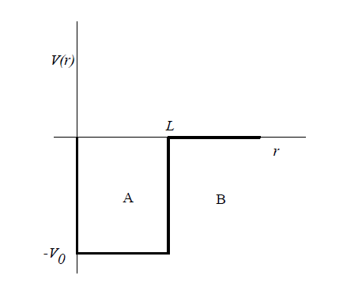

# Deuterium
In this project, Deuterium's potential is assumed to be that of a symmetric Potential Well of $V_0$ depth and $L$ length.

  

$$
N(a) = \left\{
\begin{array}{ll}
n_o & \text{if } A > A_{\text{krit}} \\
n_o + 2 & \text{if } A = A_{\text{krit}} \\
n_o + 4 & \text{if } A < A_{\text{krit}} \\
\end{array}
\right.
$$
